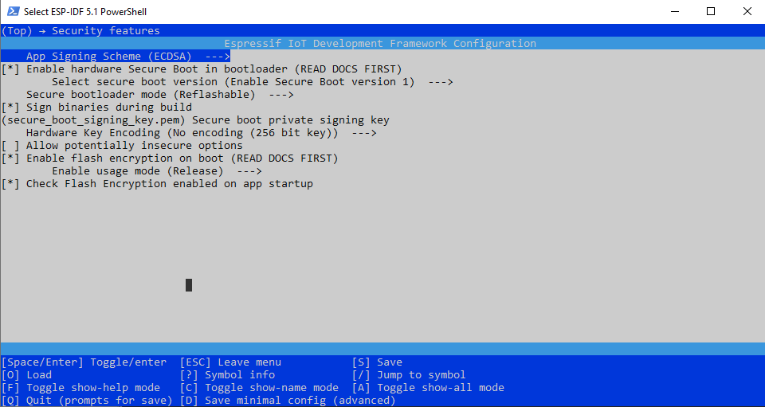

# Secure Boot and Encypt Flash

[](mailto:longhd4196@gmail.com)
[](https://www.paypal.me/ldragon196)

This project serves as a template for ESP32/ESP32S3/ESP32S2/ESP32C3... projects using Secure Boot and Encrypt Flash as well as OTA upgrade.

You can copy this project and then add your features.

Refer to: https://docs.espressif.com/projects/esp-idf/en/stable/esp32/security/secure-boot-v1.html

## Steps
1. Generate key
```
espsecure.py generate_signing_key secure_signing_key.pem
```

2. Go to Menuconfig -> Security features



3. Change the bootloader size and use the custom partition table
Menuconfif -> Partition Table -> Partition Table -> Custom partition table CSV
Menuconfif -> Partition Table -> Offset of partition table -> 0xD000

4. Generate SHA-256 digest
```
espsecure.py digest_private_key --keyfile secure_boot_signing_key.pem --keylen 256 zbins/secure_signing_key.bin
```

!!! Secure boot key is same as encryption key, use encryption key for both secure boot and encryption

5. Burn the keys and Burn the ABS_DONE fuse to activate the secure boot
```
espefuse.py burn_key secure_boot_v1 zbins/secure_signing_key.bin -p PORT
espefuse.py burn_key flash_encryption zbins/secure_signing_key.bin -p PORT
espefuse.py burn_efuse ABS_DONE_0 1 -p PORT
espefuse.py burn_efuse FLASH_CRYPT_CNT 127 -p PORT
espefuse.py burn_efuse FLASH_CRYPT_CONFIG 15 -p PORT
```

To verify, run this command to get status
```
espefuse.py summary -p PORT
```

6. Check Encryption status
```
espefuse.py -p PORT summary
```

7. Encrypting and flashing
```
idf.py erase_flash -p PORT

espsecure.py encrypt_flash_data --keyfile zbins/secure_signing_key.bin --address 0x000000 -o zbins/bootloader_encrypted.bin build/bootloader/bootloader-reflash-digest.bin
esptool.py --chip esp32 --port PORT --baud 921600 --before default_reset --after hard_reset write_flash -z --flash_mode dio --flash_freq 40m --flash_size detect 0x000000 zbins/bootloader_encrypted.bin

espsecure.py encrypt_flash_data --keyfile zbins/secure_signing_key.bin --address 0x00D000 -o zbins/partitions_encrypted.bin build/partition_table/partition-table.bin
esptool.py --chip esp32 --port PORT --baud 921600 --before default_reset --after hard_reset write_flash -z --flash_mode dio --flash_freq 40m --flash_size detect 0x00D000 zbins/partitions_encrypted.bin

espsecure.py encrypt_flash_data --keyfile zbins/secure_signing_key.bin --address 0x014000 -o zbins/otadata_encrypted.bin build/ota_data_initial.bin
esptool.py --chip esp32 --port PORT --baud 921600 --before default_reset --after hard_reset write_flash -z --flash_mode dio --flash_freq 40m --flash_size detect 0x014000 zbins/otadata_encrypted.bin

espsecure.py encrypt_flash_data --keyfile zbins/secure_signing_key.bin --address 0x020000 -o zbins/esp_secure_encrypted.bin build/esp_secure.bin
esptool.py --chip esp32 --port PORT --baud 921600 --before default_reset --after hard_reset write_flash -z --flash_mode dio --flash_freq 40m --flash_size detect 0x020000 zbins/esp_secure_encrypted.bin
```

## Using Windows Command Prompt when developing
- Run './reflash.bat' to erase flash and flash partition/ota/bootloader again (one time)
- Run './flash.bat' to build and upload firmware


### Note
Replace PORT with your serial port identifier (e.g., /dev/ttyUSB0 or COM5).